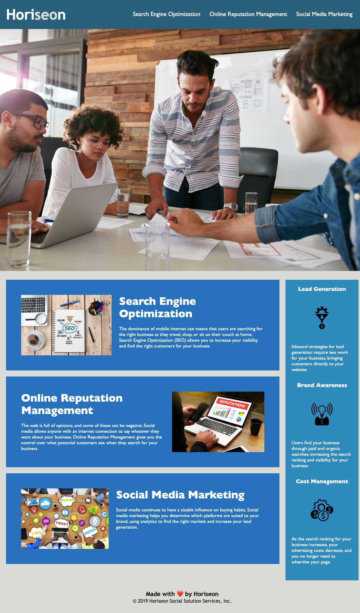

# horiseon-site-optimization

## Description

I began this project in order to make the Horiseon Social Solution Services website more accessible for people with disabilities. Before I started working on this project, the html contained many div elements, which do not allow for seamless use of the technology and transmission of information for people who use assistive technologies, such as video captions, screen readers, and braille keyboards. 

In order to solve that, I changed every div element to a semantic HTML element. Along with this, I increased the efficiency and sustainability of the HTML and CSS code by consolidating the CSS and organizing it to follow the semantic structure of the HTML. 

During this project, I learned the importance of semantic HTML elements and how to keep my CSS and HTML files in sync as I make changes. I also learned how to properly consolidate CSS styles without breaking the code and how to leave code cleaner than when you found it.

## Usage

This is the link to the completed application: ADD LINK!!!!

This is a screenshot of the completed application:

## How to Contribute

For information on how to contribute to this project, please email me at erothman@tulane.edu!

